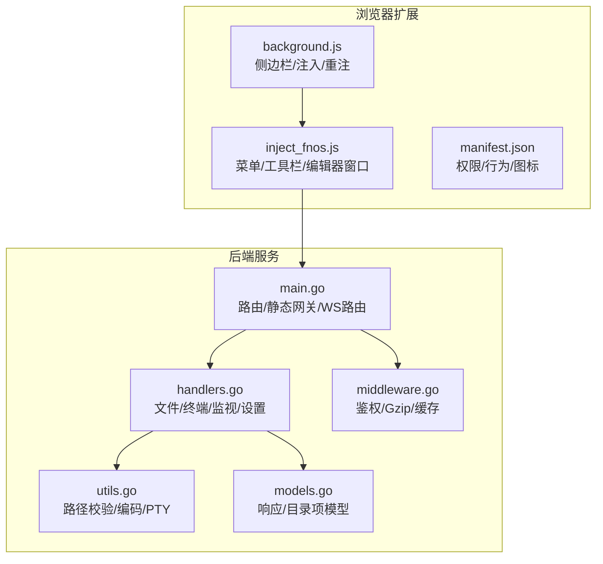
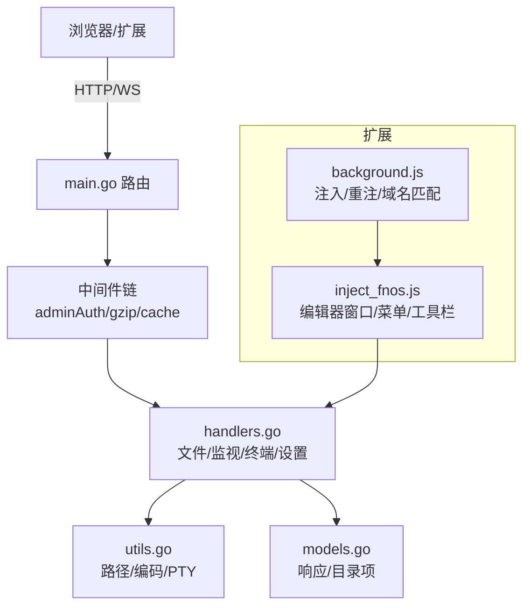
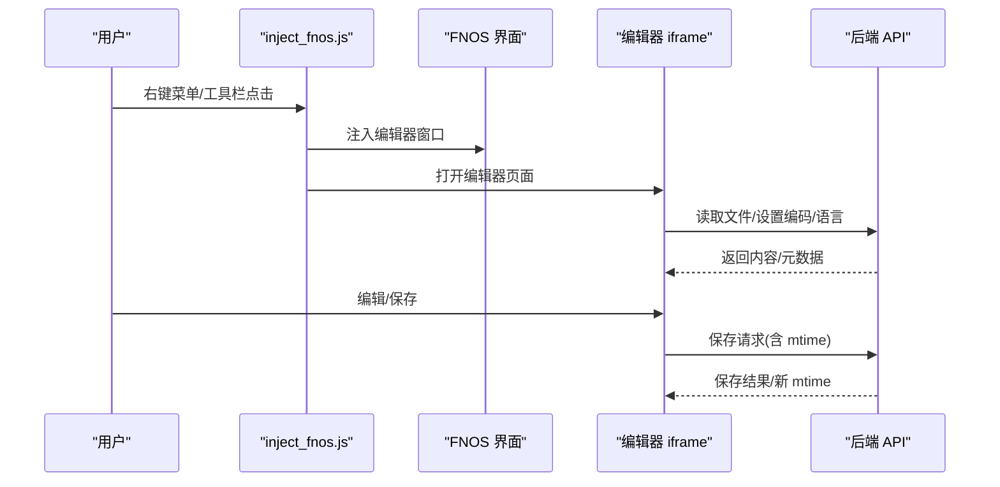
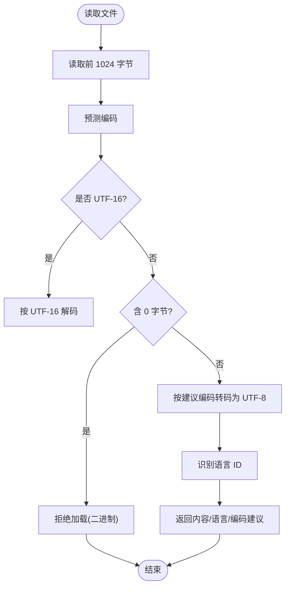
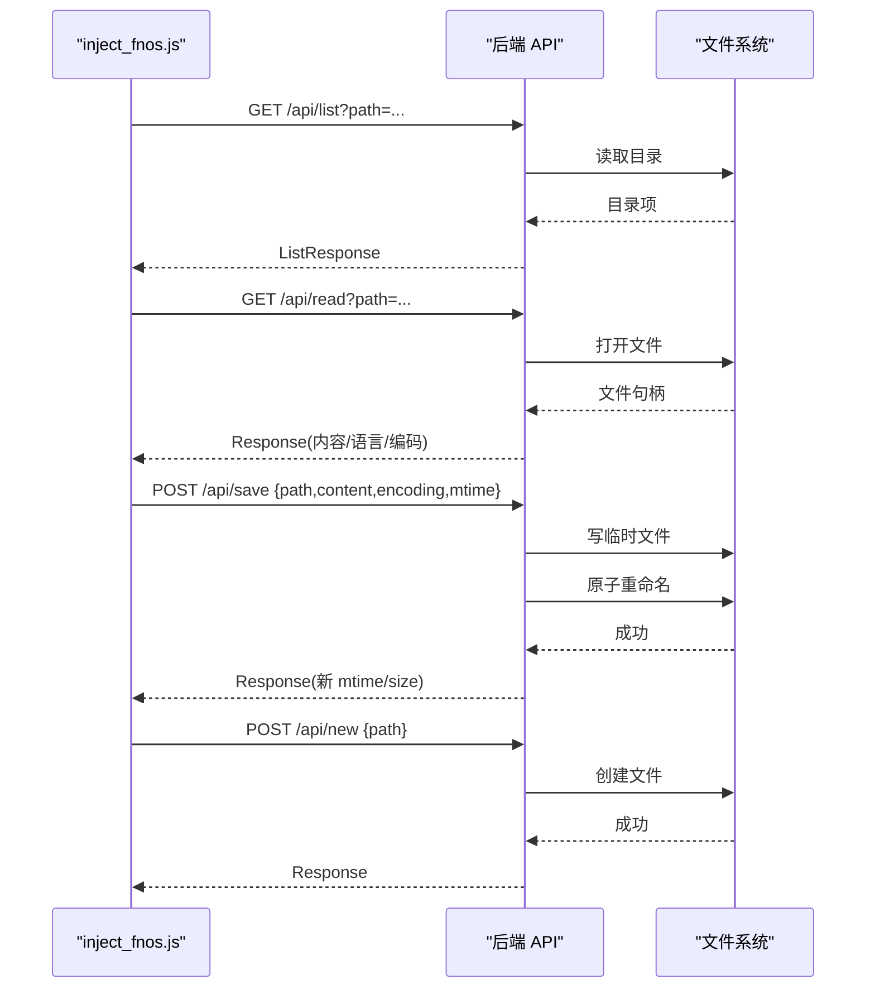
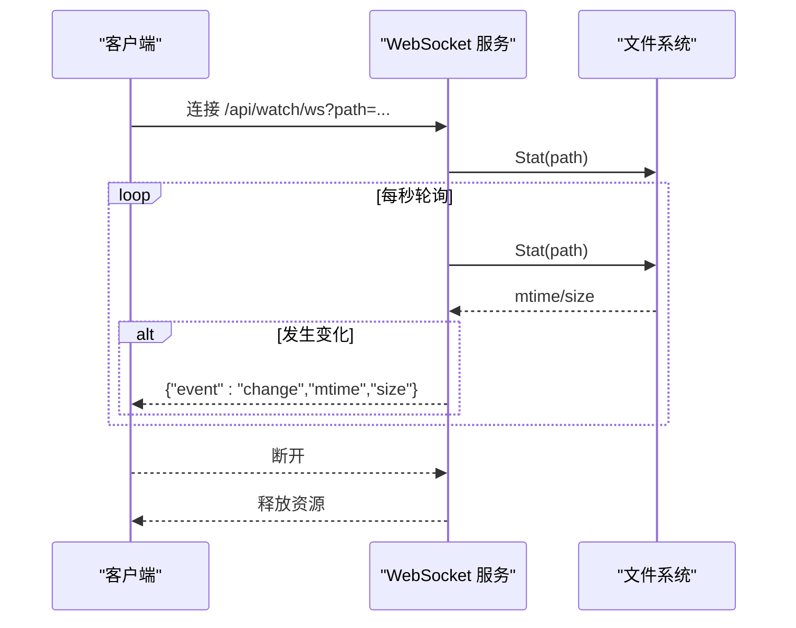
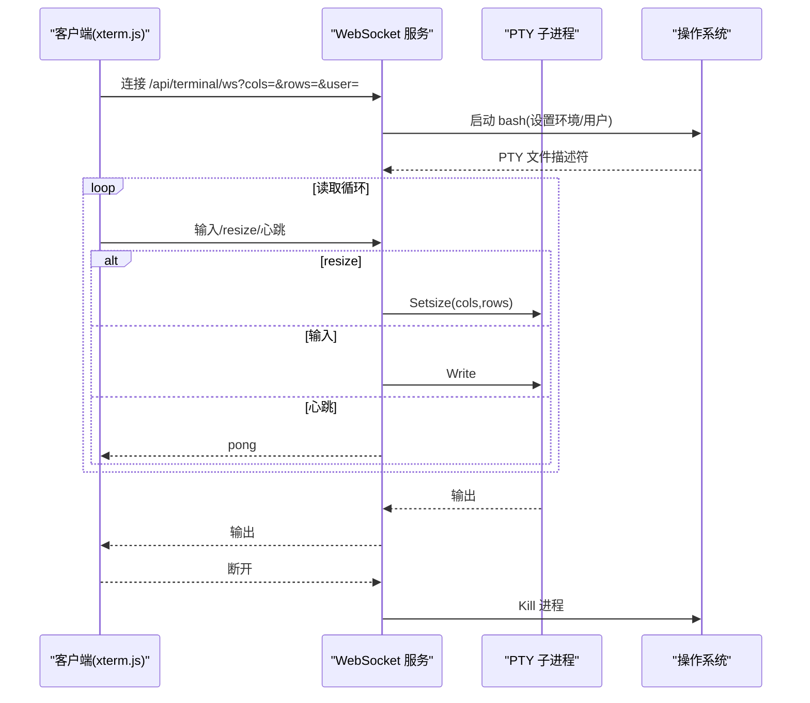
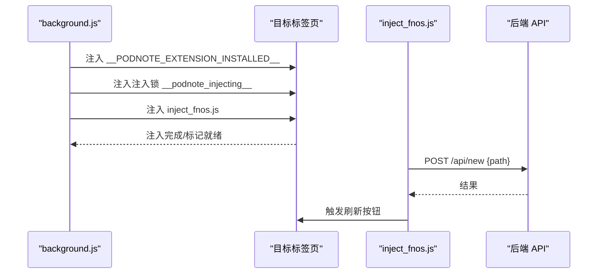
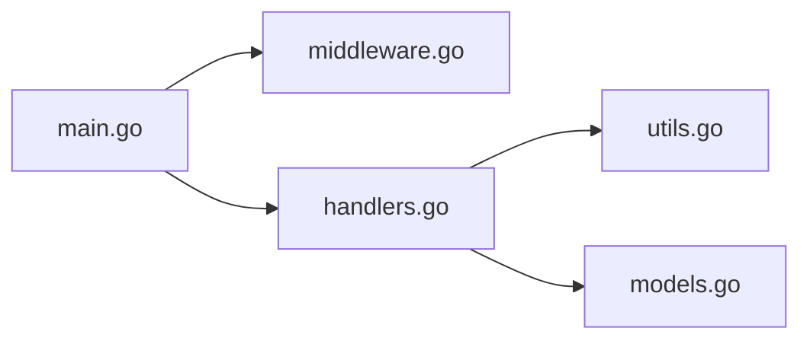

# 核心功能

<cite>
**本文引用的文件**
- [README.md](file://README.md)
- [src/README.md](file://src/README.md)
- [src/main.go](file://src/main.go)
- [src/handlers.go](file://src/handlers.go)
- [src/models.go](file://src/models.go)
- [src/utils.go](file://src/utils.go)
- [src/middleware.go](file://src/middleware.go)
- [chrome_extension/manifest.json](file://chrome_extension/manifest.json)
- [chrome_extension/background.js](file://chrome_extension/background.js)
- [chrome_extension/inject_fnos.js](file://chrome_extension/inject_fnos.js)
</cite>

## 目录
1. [简介](#简介)
2. [项目结构](#项目结构)
3. [核心组件](#核心组件)
4. [架构总览](#架构总览)
5. [详细组件分析](#详细组件分析)
6. [依赖关系分析](#依赖关系分析)
7. [性能考量](#性能考量)
8. [故障排查指南](#故障排查指南)
9. [结论](#结论)
10. [附录](#附录)

## 简介
本文件面向 PodNote 的核心功能，围绕以下主题展开：文件编辑（Monaco Editor 集成、多标签页管理、语法高亮）、文件管理操作（读取、保存、创建、目录浏览）的安全实现、实时监控系统（WebSocket 文件变更通知）、集成交互式终端（PTY 会话与 xterm.js）、Chrome 扩展与后端通信机制。文档提供架构图、序列图、流程图与最佳实践建议，帮助读者快速理解并高效使用 PodNote。

## 项目结构
- 后端服务（Go）位于 src/，通过 Unix Socket 对外提供 API 与 WebSocket 服务。
- Chrome 扩展位于 chrome_extension/，负责在 FNOS 文件管理器中注入 PodNote 能力。
- README.md 提供高层介绍与使用说明。

图表来源
- [src/main.go:14-145](file://src/main.go#L14-L145)
- [src/handlers.go:1-614](file://src/handlers.go#L1-L614)
- [src/utils.go:1-262](file://src/utils.go#L1-L262)
- [src/middleware.go:1-103](file://src/middleware.go#L1-L103)
- [src/models.go:1-30](file://src/models.go#L1-L30)
- [chrome_extension/background.js:1-169](file://chrome_extension/background.js#L1-L169)
- [chrome_extension/inject_fnos.js:1-898](file://chrome_extension/inject_fnos.js#L1-L898)
- [chrome_extension/manifest.json:1-28](file://chrome_extension/manifest.json#L1-L28)

章节来源
- [README.md:1-39](file://README.md#L1-L39)
- [src/README.md:1-74](file://src/README.md#L1-L74)

## 核心组件
- 文件编辑与多标签页：通过在 FNOS 文件管理器中注入编辑器窗口，以 iframe 打开后端提供的编辑页面，支持窗口拖拽、缩放、最大化、幽灵模式等。
- 文件管理 API：提供目录浏览、文件读取、保存、创建、设置读写等接口，均经过严格的路径校验与安全限制。
- 实时监控：基于 WebSocket 的文件变更通知，周期性轮询文件元信息并在变化时推送事件。
- 交互式终端：通过 WebSocket 与 PTY 桥接，支持窗口尺寸调整与心跳保活。
- Chrome 扩展：在合适域名/端口下自动注入脚本，提供右键菜单与工具栏“新建文件”按钮，并与后端通信。

章节来源
- [src/handlers.go:21-112](file://src/handlers.go#L21-L112)
- [src/handlers.go:114-212](file://src/handlers.go#L114-L212)
- [src/handlers.go:214-324](file://src/handlers.go#L214-L324)
- [src/handlers.go:326-424](file://src/handlers.go#L326-L424)
- [src/handlers.go:426-494](file://src/handlers.go#L426-L494)
- [src/handlers.go:496-516](file://src/handlers.go#L496-L516)
- [chrome_extension/inject_fnos.js:317-595](file://chrome_extension/inject_fnos.js#L317-L595)
- [chrome_extension/inject_fnos.js:800-868](file://chrome_extension/inject_fnos.js#L800-L868)

## 架构总览
后端通过 Unix Socket 监听，路由层将静态资源与业务 API 分离，中间件链完成鉴权、压缩与缓存。前端编辑器通过 iframe 与后端交互，扩展负责在 FNOS 界面中注入 PodNote 能力并与后端通信。

图表来源
- [src/main.go:37-129](file://src/main.go#L37-L129)
- [src/middleware.go:22-92](file://src/middleware.go#L22-L92)
- [src/handlers.go:112-119](file://src/handlers.go#L112-L119)
- [src/utils.go:25-53](file://src/utils.go#L25-L53)
- [chrome_extension/background.js:40-117](file://chrome_extension/background.js#L40-L117)
- [chrome_extension/inject_fnos.js:1-898](file://chrome_extension/inject_fnos.js#L1-L898)

## 详细组件分析

### 文件编辑与多标签页管理
- 窗口注入与生命周期：扩展在 FNOS 页面中注入编辑器窗口，使用唯一标识与 z-index 管理层级，支持拖拽、缩放、双击最大化/还原、关闭。
- 幽灵模式：窗口可进入“幽灵模式”，穿透点击，仅保留按钮交互，便于系统交互时不影响编辑器。
- 状态持久化：窗口位置与尺寸保存在本地存储，下次打开恢复。
- 与后端通信：通过 iframe 加载后端编辑页面，编辑器窗口与后端通过 API 交互。

图表来源
- [chrome_extension/inject_fnos.js:317-595](file://chrome_extension/inject_fnos.js#L317-L595)
- [src/handlers.go:114-212](file://src/handlers.go#L114-L212)
- [src/handlers.go:214-324](file://src/handlers.go#L214-L324)

章节来源
- [chrome_extension/inject_fnos.js:317-595](file://chrome_extension/inject_fnos.js#L317-L595)
- [chrome_extension/inject_fnos.js:676-868](file://chrome_extension/inject_fnos.js#L676-L868)

### Monaco Editor 集成与语法高亮
- 语言识别：根据文件扩展名与 shebang 自动识别语言 ID，用于启用对应语法高亮。
- 编码处理：读取文件时探测编码，非 UTF-8 自动转码为 UTF-8，避免乱码。
- 静态资源：Monaco 核心资源通过静态网关提供并强缓存，提升加载性能。

图表来源
- [src/handlers.go:114-212](file://src/handlers.go#L114-L212)
- [src/utils.go:55-106](file://src/utils.go#L55-L106)
- [src/utils.go:108-165](file://src/utils.go#L108-L165)

章节来源
- [src/handlers.go:114-212](file://src/handlers.go#L114-L212)
- [src/utils.go:55-106](file://src/utils.go#L55-L106)
- [src/utils.go:108-165](file://src/utils.go#L108-L165)

### 文件管理操作（读取/保存/创建/目录浏览）
- 目录浏览：校验路径安全后读取目录项，忽略隐藏文件，按文件夹优先、名称排序返回。
- 文件读取：限制最大 10MB，探测编码并转码，返回内容、修改时间、大小、权限与语言。
- 文件保存：采用“同级临时文件 + 原子重命名”的策略，保持权限与所有权，支持乐观锁并发控制。
- 新建文件：预检路径合法性与父目录存在性，再创建物理文件并同步权限。

图表来源
- [src/handlers.go:21-112](file://src/handlers.go#L21-L112)
- [src/handlers.go:114-212](file://src/handlers.go#L114-L212)
- [src/handlers.go:214-324](file://src/handlers.go#L214-L324)
- [src/handlers.go:363-424](file://src/handlers.go#L363-L424)

章节来源
- [src/handlers.go:21-112](file://src/handlers.go#L21-L112)
- [src/handlers.go:114-212](file://src/handlers.go#L114-L212)
- [src/handlers.go:214-324](file://src/handlers.go#L214-L324)
- [src/handlers.go:363-424](file://src/handlers.go#L363-L424)

### 实时监控系统（WebSocket 文件变更通知）
- 连接建立：客户端发起 WebSocket 连接，携带目标文件路径参数。
- 轮询策略：服务端以固定周期读取文件元信息，比较 mtime 与 size，发生变化即推送变更事件。
- 断开处理：检测客户端读取阻塞或异常，及时释放资源。

图表来源
- [src/handlers.go:426-494](file://src/handlers.go#L426-L494)

章节来源
- [src/handlers.go:426-494](file://src/handlers.go#L426-L494)

### 集成交互式终端（PTY 会话与 xterm.js）
- 会话建立：客户端通过 WebSocket 连接后端，后端启动 bash PTY，设置 TERM/LANG 等环境变量。
- 用户切换：支持按用户名切换 UID/GID 与工作目录，否则默认 root。
- 数据转发：双向转发 WebSocket 与 PTY 的数据流；支持窗口尺寸调整消息与心跳保活。
- 资源清理：会话结束或异常时清理进程与文件描述符。

图表来源
- [src/handlers.go:496-516](file://src/handlers.go#L496-L516)
- [src/utils.go:167-261](file://src/utils.go#L167-L261)

章节来源
- [src/handlers.go:496-516](file://src/handlers.go#L496-L516)
- [src/utils.go:167-261](file://src/utils.go#L167-L261)

### Chrome 扩展与后端通信机制
- 权限与行为：声明 scripting、storage、tabs、sidePanel 权限，侧边栏默认打开。
- 域名匹配：根据本地存储的规则匹配允许注入的域名/端口，避免误注入。
- 注入策略：在页面加载完成后注入“已安装”标记与注入锁，互斥避免重复注入；ISOLATED 监控存活标记，必要时自动重注。
- 与编辑器协作：注入编辑器窗口、右键菜单“使用 PodNote 编辑”、工具栏“新建文件”按钮；调用后端 API 完成文件创建与刷新。

图表来源
- [chrome_extension/manifest.json:1-28](file://chrome_extension/manifest.json#L1-L28)
- [chrome_extension/background.js:40-117](file://chrome_extension/background.js#L40-L117)
- [chrome_extension/inject_fnos.js:800-868](file://chrome_extension/inject_fnos.js#L800-L868)

章节来源
- [chrome_extension/manifest.json:1-28](file://chrome_extension/manifest.json#L1-L28)
- [chrome_extension/background.js:40-117](file://chrome_extension/background.js#L40-L117)
- [chrome_extension/inject_fnos.js:800-868](file://chrome_extension/inject_fnos.js#L800-L868)

## 依赖关系分析
- 路由与中间件：main.go 负责路由注册与中间件链包装；middleware.go 提供鉴权、Gzip 压缩与缓存策略。
- 业务处理：handlers.go 聚合文件、监视、终端、设置等处理函数。
- 工具函数：utils.go 提供路径安全校验、编码探测、语言识别与 PTY 会话管理。
- 模型定义：models.go 定义统一响应与目录项结构，便于前后端契约一致。

图表来源
- [src/main.go:37-129](file://src/main.go#L37-L129)
- [src/middleware.go:22-92](file://src/middleware.go#L22-L92)
- [src/handlers.go:112-119](file://src/handlers.go#L112-L119)
- [src/utils.go:25-53](file://src/utils.go#L25-L53)
- [src/models.go:3-29](file://src/models.go#L3-L29)

章节来源
- [src/main.go:37-129](file://src/main.go#L37-L129)
- [src/middleware.go:22-92](file://src/middleware.go#L22-L92)
- [src/handlers.go:112-119](file://src/handlers.go#L112-L119)
- [src/utils.go:25-53](file://src/utils.go#L25-L53)
- [src/models.go:3-29](file://src/models.go#L3-L29)

## 性能考量
- 静态资源缓存：Monaco 核心资源强缓存一年，带版本号的业务脚本缓存 30 天，普通静态资源缓存 1 天，显著降低带宽与首屏时间。
- Gzip 压缩：对文本类资源与 API 响应启用透明压缩，减少传输体积。
- 文件读取限制：单文件最大 10MB，避免编辑器与后端压力过大。
- PTY 保活：终端会话设置读超时，防止长时间无交互导致资源泄漏。
- WebSocket 轮询：文件监控每秒一次，折中兼顾实时性与 CPU 占用。

章节来源
- [src/middleware.go:74-92](file://src/middleware.go#L74-L92)
- [src/middleware.go:40-72](file://src/middleware.go#L40-L72)
- [src/handlers.go:146-151](file://src/handlers.go#L146-L151)
- [src/utils.go:230-256](file://src/utils.go#L230-L256)
- [src/handlers.go:448-493](file://src/handlers.go#L448-L493)

## 故障排查指南
- 路径安全错误：cleanAndValidatePath 拒绝访问应用自身资源目录或非法路径，检查 TRIM_APPDEST 环境变量与传入路径。
- 编码问题：若读取出现乱码，确认文件真实编码并通过参数覆盖；后端会自动探测并建议编码。
- 并发保存冲突：若保存返回“文件已被外部修改”，请刷新页面后重试。
- 终端权限不足：非管理员用户在生产环境会被拒绝访问终端，需具备管理员权限。
- WebSocket 断开：终端与监视连接均设置超时与心跳，若频繁断开，检查网络稳定性与客户端保活。

章节来源
- [src/utils.go:25-53](file://src/utils.go#L25-L53)
- [src/handlers.go:178-201](file://src/handlers.go#L178-L201)
- [src/handlers.go:253-262](file://src/handlers.go#L253-L262)
- [src/middleware.go:22-38](file://src/middleware.go#L22-L38)
- [src/utils.go:230-256](file://src/utils.go#L230-L256)
- [src/handlers.go:464-493](file://src/handlers.go#L464-L493)

## 结论
PodNote 通过严谨的安全路径校验、高效的中间件链与清晰的 API 设计，实现了稳定可靠的文件编辑与管理能力；结合 Chrome 扩展与后端的紧密协作，提供了流畅的 FNOS 集成体验；实时监控与交互式终端进一步增强了开发效率与可观测性。遵循本文的最佳实践与排障建议，可在生产环境中获得更佳的性能与稳定性。

## 附录
- 使用示例（路径参考）
  - 目录浏览：GET /app/m-text-editor/api/list?path=/home/user
  - 文件读取：GET /app/m-text-editor/api/read?path=/home/user/demo.txt
  - 文件保存：POST /app/m-text-editor/api/save（请求体包含 path/content/encoding/mtime）
  - 新建文件：POST /app/m-text-editor/api/new（请求体包含 path）
  - 文件监视：/app/m-text-editor/api/watch/ws?path=/home/user/demo.txt
  - 终端会话：/app/m-text-editor/api/terminal/ws?cols=80&rows=24&user=current
- 最佳实践
  - 严格限制文件大小与并发写入，避免阻塞与覆盖风险。
  - 合理设置缓存与压缩策略，平衡首屏速度与带宽消耗。
  - 在生产环境启用管理员鉴权，避免终端滥用。
  - 定期检查 WebSocket 与 PTY 资源清理，防止僵尸进程与连接泄漏。