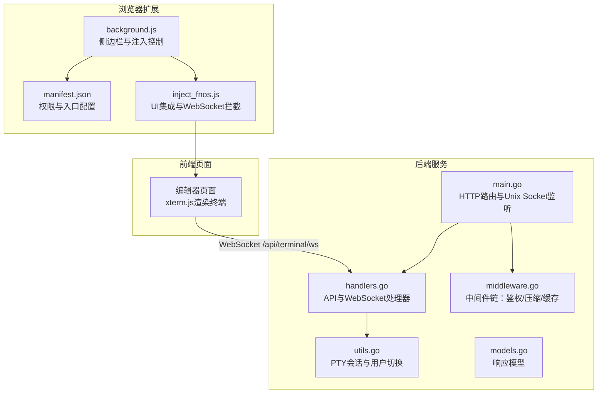
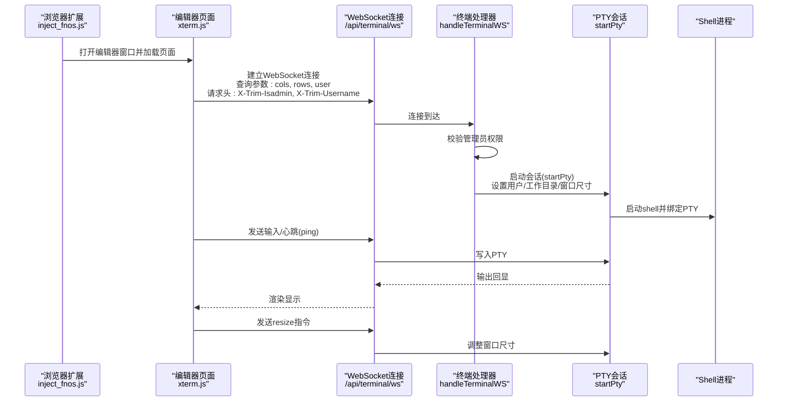
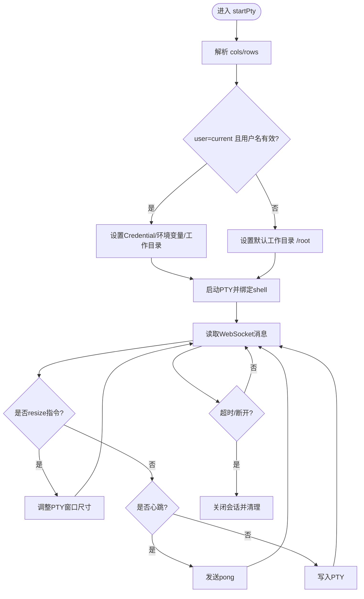
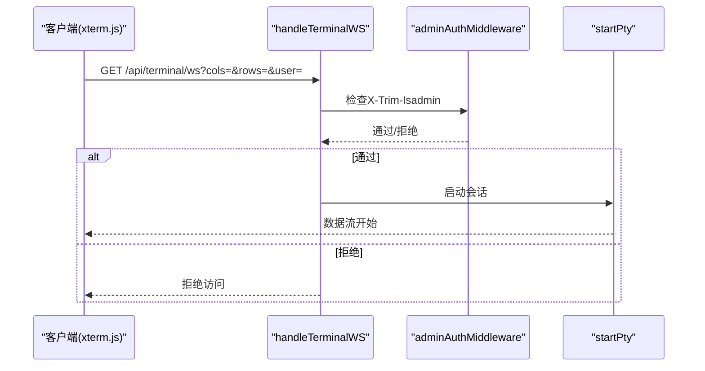
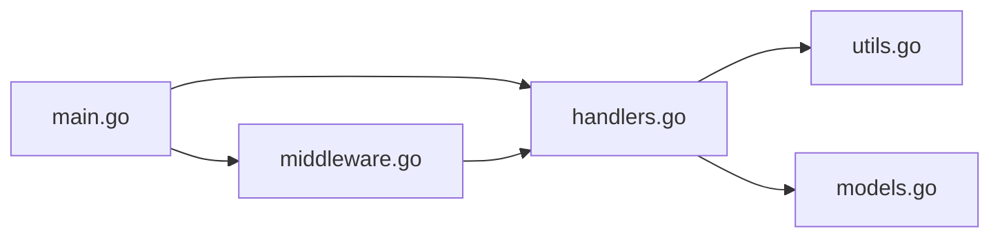

# 终端集成功能

<cite>
**本文引用的文件**
- [src/main.go](file://src/main.go)
- [src/handlers.go](file://src/handlers.go)
- [src/utils.go](file://src/utils.go)
- [src/middleware.go](file://src/middleware.go)
- [src/models.go](file://src/models.go)
- [chrome_extension/background.js](file://chrome_extension/background.js)
- [chrome_extension/inject_fnos.js](file://chrome_extension/inject_fnos.js)
- [chrome_extension/manifest.json](file://chrome_extension/manifest.json)
- [README.md](file://README.md)
</cite>

## 目录
1. [简介](#简介)
2. [项目结构](#项目结构)
3. [核心组件](#核心组件)
4. [架构总览](#架构总览)
5. [组件详解](#组件详解)
6. [依赖关系分析](#依赖关系分析)
7. [性能考量](#性能考量)
8. [故障排除指南](#故障排除指南)
9. [结论](#结论)
10. [附录](#附录)

## 简介
本文件面向“终端集成功能”的技术实现，围绕以下主题展开：
- PTY（伪终端仿真）会话管理：会话创建、窗口尺寸调整、用户身份与权限控制
- WebSocket 终端连接流程：连接参数（cols、rows、user）、头部信息传递、权限验证机制
- xterm.js 集成方案：终端渲染、输入输出处理、用户体验优化
- 管理员权限控制与环境变量配置（TRIM_APPDEST）
- 终端会话生命周期：连接建立、数据传输、会话终止
- 完整集成示例与故障排除指南
- 安全与性能优化建议

## 项目结构
后端采用 Go 语言，通过 Unix Socket 对外提供 HTTP 服务；前端通过浏览器扩展与 FNOS 文件管理器深度集成，编辑器页面内嵌 xterm.js 实现终端渲染。

图表来源
- [src/main.go:15-145](file://src/main.go#L15-L145)
- [src/handlers.go:496-516](file://src/handlers.go#L496-L516)
- [src/utils.go:166-261](file://src/utils.go#L166-L261)
- [src/middleware.go:22-92](file://src/middleware.go#L22-L92)
- [src/models.go:3-29](file://src/models.go#L3-L29)
- [chrome_extension/background.js:1-169](file://chrome_extension/background.js#L1-L169)
- [chrome_extension/inject_fnos.js:1-800](file://chrome_extension/inject_fnos.js#L1-L800)
- [chrome_extension/manifest.json:1-28](file://chrome_extension/manifest.json#L1-L28)

章节来源
- [src/main.go:15-145](file://src/main.go#L15-L145)
- [README.md:1-39](file://README.md#L1-L39)

## 核心组件
- HTTP 服务与路由
  - 使用 Unix Socket 监听，提供动态入口服务与静态资源转发，注册文件监控与终端 WebSocket 路由
- 中间件链
  - 管理员鉴权、Gzip 压缩、缓存控制、日志审计
- 终端 WebSocket 处理器
  - 校验管理员权限、解析连接参数、启动 PTY 会话、转发输入输出
- PTY 会话管理
  - 用户切换、工作目录、窗口尺寸调整、超时与心跳、输入输出双向转发
- 浏览器扩展
  - 注入编辑器窗口、拦截文件管理器 WebSocket、注入右键菜单与工具栏按钮

章节来源
- [src/main.go:37-129](file://src/main.go#L37-L129)
- [src/middleware.go:22-92](file://src/middleware.go#L22-L92)
- [src/handlers.go:496-516](file://src/handlers.go#L496-L516)
- [src/utils.go:166-261](file://src/utils.go#L166-L261)
- [chrome_extension/inject_fnos.js:317-595](file://chrome_extension/inject_fnos.js#L317-L595)

## 架构总览
下图展示从浏览器扩展到后端服务再到 PTY 的端到端调用链路。

图表来源
- [src/handlers.go:496-516](file://src/handlers.go#L496-L516)
- [src/utils.go:166-261](file://src/utils.go#L166-L261)
- [chrome_extension/inject_fnos.js:317-595](file://chrome_extension/inject_fnos.js#L317-L595)

## 组件详解

### PTY 会话管理
- 会话创建
  - 解析 cols/rows，构造 PTY 窗口尺寸
  - 支持根据 user=current 与 X-Trim-Username 切换执行用户，设置 HOME/USER/LOGNAME 等环境变量
  - 默认工作目录为 /root，若用户家目录存在则切换
- 窗口尺寸调整
  - 客户端发送以特定前缀标识的 resize 消息，后端解析并调用 PTY 调整尺寸
- 用户身份与权限
  - 当 TRIM_APPDEST 存在时启用管理员校验，要求 X-Trim-Isadmin=true
  - 若非管理员，直接拒绝连接
- 会话生命周期
  - 读循环设置超时，90秒无活动自动断开
  - 心跳 ping/pong 保持连接活性
  - 输入写入 PTY，PTY 输出通过 io.Copy 回传 WebSocket

图表来源
- [src/utils.go:166-261](file://src/utils.go#L166-L261)

章节来源
- [src/utils.go:166-261](file://src/utils.go#L166-L261)

### WebSocket 终端连接流程
- 连接参数
  - 查询参数：cols、rows、user
  - 请求头：X-Trim-Isadmin、X-Trim-Username
- 权限验证
  - 中间件与处理器双重校验管理员身份
- 连接建立与会话启动
  - 校验通过后调用 startPty，完成 PTY 初始化与数据转发

图表来源
- [src/handlers.go:496-516](file://src/handlers.go#L496-L516)
- [src/middleware.go:22-38](file://src/middleware.go#L22-L38)

章节来源
- [src/handlers.go:496-516](file://src/handlers.go#L496-L516)
- [src/middleware.go:22-38](file://src/middleware.go#L22-L38)

### xterm.js 集成方案
- 终端渲染
  - 页面内嵌 xterm.js，通过 WebSocket 接收后端输出并渲染
- 输入输出处理
  - 输入：将键盘事件转换为字符串写入 WebSocket
  - 输出：后端将 PTY 输出通过 io.Copy 写回 WebSocket
  - 心跳：周期性发送 ping，收到 pong 保持活跃
  - 尺寸调整：发送特定前缀的 resize 指令，后端调用 PTY 调整
- 用户体验优化
  - 编辑器窗口可拖拽、缩放、最大化/还原
  - 幽灵模式（穿透）便于多任务协作
  - 窗口置顶、阴影与动画提升交互质感

章节来源
- [chrome_extension/inject_fnos.js:317-595](file://chrome_extension/inject_fnos.js#L317-L595)

### 管理员权限控制与环境变量
- 环境变量
  - TRIM_APPDEST：启用生产模式与管理员校验
  - TRIM_APPVER：前端资源版本注入
  - TRIM_PKGVAR：配置文件存储路径
- 权限控制
  - 中间件与终端处理器均校验 X-Trim-Isadmin=true
  - 非管理员访问被拒绝

章节来源
- [src/main.go:16-28](file://src/main.go#L16-L28)
- [src/middleware.go:22-38](file://src/middleware.go#L22-L38)
- [src/handlers.go:503-512](file://src/handlers.go#L503-L512)

### 终端会话生命周期
- 建立：解析参数、校验权限、初始化 PTY
- 数据传输：输入写入 PTY，输出回传 WebSocket，心跳维持
- 终止：超时断开、进程清理、资源回收

章节来源
- [src/utils.go:230-261](file://src/utils.go#L230-L261)

## 依赖关系分析
- 组件耦合
  - main.go 负责路由与中间件装配，handlers.go 提供业务处理，utils.go 封装 PTY 会话，middleware.go 提供横切能力
- 外部依赖
  - golang.org/x/net/websocket：WebSocket 协议
  - github.com/creack/pty：PTY 仿真
  - golang.org/x/text：字符编码检测与转换
- 潜在环路
  - 无直接循环导入；模块职责清晰

图表来源
- [src/main.go:111-129](file://src/main.go#L111-L129)
- [src/handlers.go:1-20](file://src/handlers.go#L1-L20)
- [src/middleware.go:1-12](file://src/middleware.go#L1-L12)
- [src/utils.go:13-20](file://src/utils.go#L13-L20)
- [src/models.go:1-12](file://src/models.go#L1-L12)

章节来源
- [src/main.go:111-129](file://src/main.go#L111-L129)
- [src/handlers.go:1-20](file://src/handlers.go#L1-L20)
- [src/middleware.go:1-12](file://src/middleware.go#L1-L12)
- [src/utils.go:13-20](file://src/utils.go#L13-L20)
- [src/models.go:1-12](file://src/models.go#L1-L12)

## 性能考量
- 压缩与缓存
  - Gzip 压缩：对 JS/CSS/HTML 与 API 响应进行透明压缩，降低带宽占用
  - 缓存策略：Monaco 核心资源强缓存一年；带版本号资源缓存 30 天；普通业务资源缓存 1 天
- 传输优化
  - WebSocket 专用于实时数据；避免对 WebSocket 路径进行 Gzip 压缩
  - PTY 输出使用 io.Copy 直通，减少额外拷贝
- 资源版本化
  - 首页与静态资源注入版本号，便于缓存控制与灰度发布

章节来源
- [src/middleware.go:40-92](file://src/middleware.go#L40-L92)
- [src/main.go:40-109](file://src/main.go#L40-L109)

## 故障排除指南
- 环境变量未设置
  - 现象：启动时报错提示未检测到 TRIM_APPDEST/TRIM_APPVER
  - 处理：在容器环境中正确设置 TRIM_APPDEST 与 TRIM_APPVER
- 管理员权限不足
  - 现象：连接被拒绝
  - 处理：确保请求头 X-Trim-Isadmin=true，或在无 TRIM_APPDEST 环境变量时绕过校验
- PTY 启动失败
  - 现象：无法启动终端
  - 处理：检查 shell 可执行性、用户权限与工作目录是否存在
- 连接超时断开
  - 现象：长时间无交互后断开
  - 处理：确保前端定期发送心跳；检查网络稳定性
- 尺寸调整无效
  - 现象：终端窗口大小不变
  - 处理：确认前端发送了正确的 resize 指令格式；后端日志中查看是否收到并处理
- 资源加载失败
  - 现象：页面样式或脚本 404
  - 处理：确认 www 目录与 TRIM_APPDEST 指向一致；检查路径拼接与版本号注入

章节来源
- [src/main.go:16-28](file://src/main.go#L16-L28)
- [src/handlers.go:503-512](file://src/handlers.go#L503-L512)
- [src/utils.go:216-221](file://src/utils.go#L216-L221)
- [src/utils.go:230-261](file://src/utils.go#L230-L261)

## 结论
本终端集成功能通过 WebSocket 与 PTY 桥接，结合 xterm.js 实现高性能、低延迟的终端交互体验。配合浏览器扩展实现 FNOS 文件管理器的深度集成，提供右键编辑、工具栏新建等便捷操作。通过管理员权限控制与环境变量配置，满足生产环境的安全与可运维需求。中间件链进一步优化传输效率与缓存策略，整体方案具备良好的扩展性与稳定性。

## 附录
- 完整集成示例
  - 启动后端服务并设置 TRIM_APPDEST/TRIM_APPVER
  - 在浏览器中安装扩展并启用侧边栏
  - 在 FNOS 文件管理器中右键选择“使用 PodNote 编辑”，打开编辑器窗口
  - 在编辑器中点击“终端”标签，建立 WebSocket 连接
  - 输入命令并观察输出，调整窗口尺寸与心跳保持连接
- 安全建议
  - 仅在可信网络中启用管理员权限
  - 定期轮换会话超时与心跳策略
  - 限制 PTY 启动用户范围，避免越权执行
- 性能优化建议
  - 前端合理设置 cols/rows，避免频繁 resize
  - 后端保持 PTY 进程稳定，避免频繁重启
  - 利用缓存与压缩策略降低带宽占用