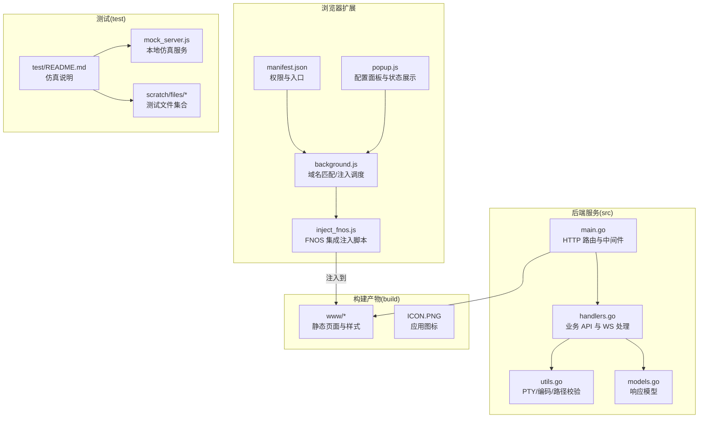
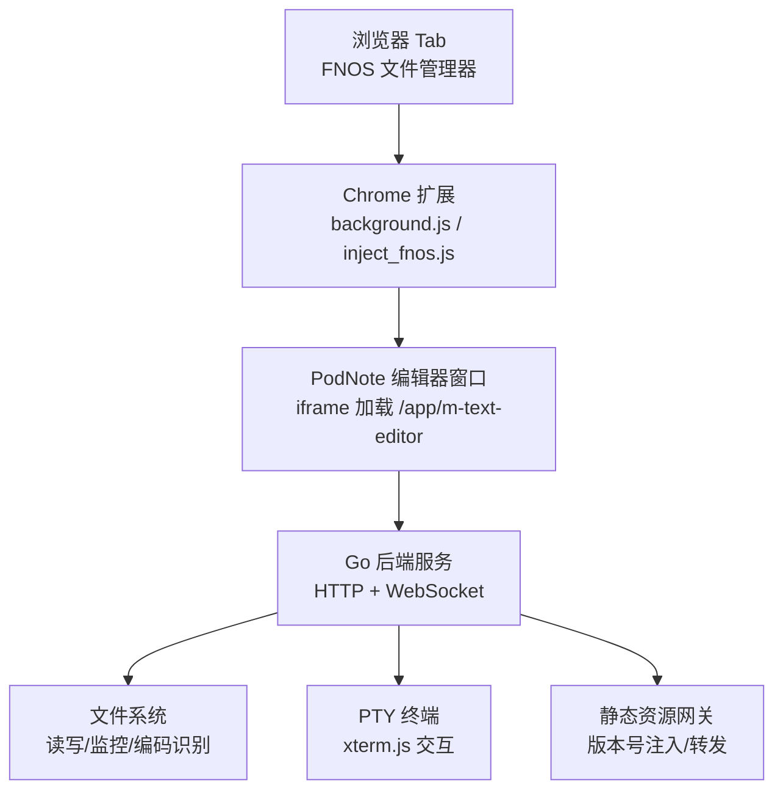
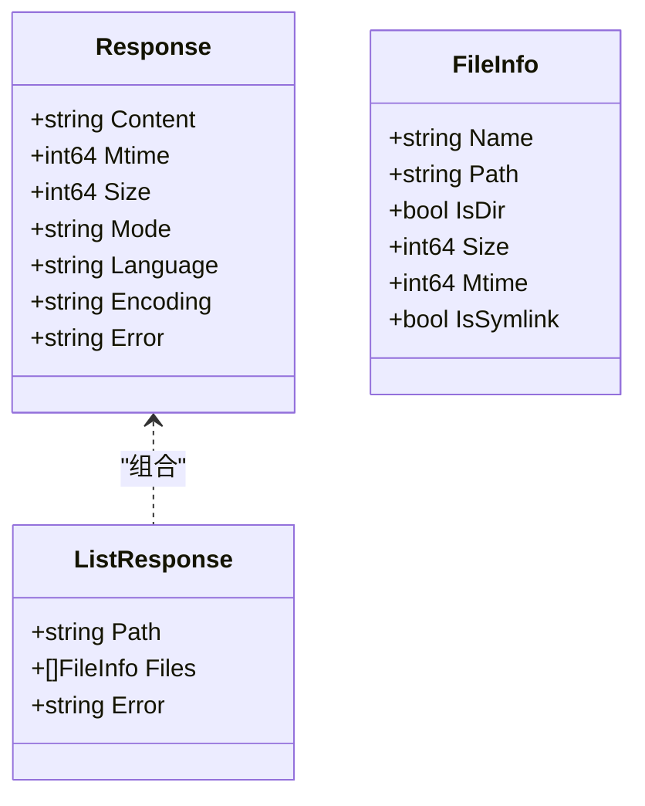
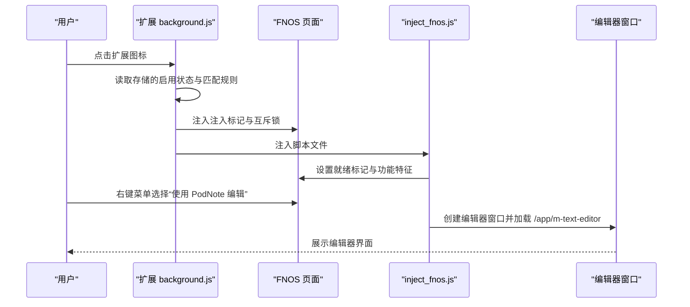
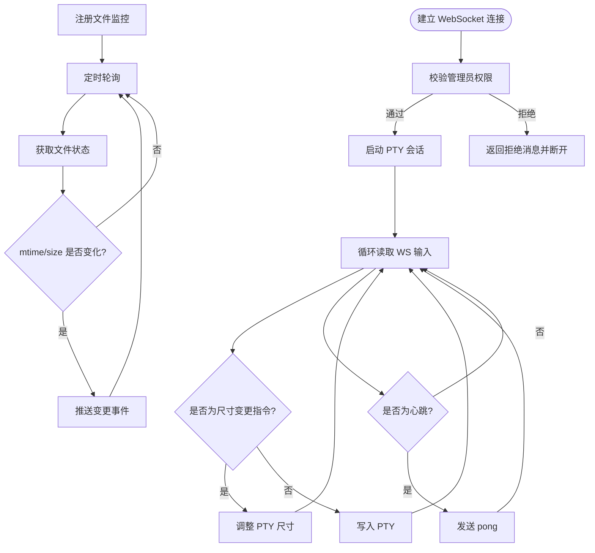
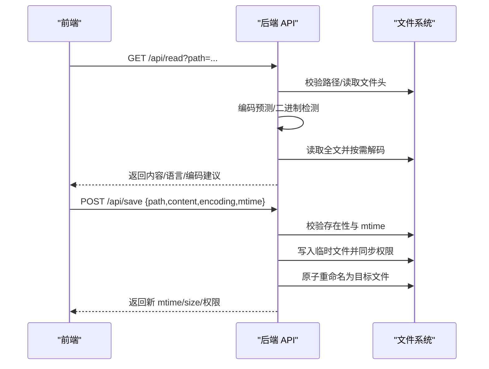
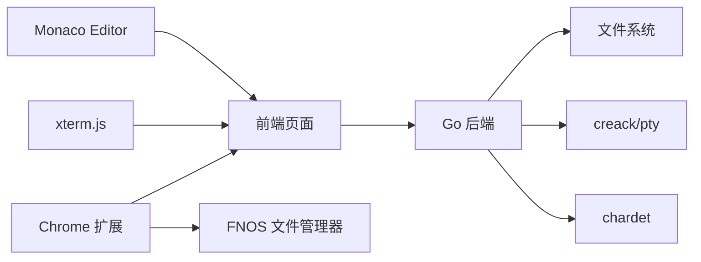

# 项目概述

<cite>
**本文引用的文件**
- [README.md](file://README.md)
- [main.go](file://src/main.go)
- [handlers.go](file://src/handlers.go)
- [models.go](file://src/models.go)
- [utils.go](file://src/utils.go)
- [manifest.json](file://chrome_extension/manifest.json)
- [background.js](file://chrome_extension/background.js)
- [popup.js](file://chrome_extension/popup.js)
- [inject_fnos.js](file://chrome_extension/inject_fnos.js)
- [test/README.md](file://test/README.md)
</cite>

## 目录
1. [简介](#简介)
2. [项目结构](#项目结构)
3. [核心组件](#核心组件)
4. [架构总览](#架构总览)
5. [详细组件分析](#详细组件分析)
6. [依赖关系分析](#依赖关系分析)
7. [性能考量](#性能考量)
8. [故障排查指南](#故障排查指南)
9. [结论](#结论)
10. [附录](#附录)

## 简介
PodNote 是一款专为飞牛OS（FNOS）打造的轻量级极速文本编辑器，采用类 VS Code 的现代化工作区设计，内置 Monaco Editor 内核，并集成交互式终端（基于 xterm.js 与 PTY）。它通过配套的 Chrome/Edge 扩展与 FNOS 文件管理器深度联动，支持右键编辑、工具栏一键新建、路径同步与窗口管理，同时提供多语言语法高亮、智能编码识别与安全的文件读写能力。

项目定位清晰：作为 FNOS 文件管理器的“即插即用”编辑器扩展，既满足日常文档编写，也兼顾运维与开发场景的高效编辑需求。

## 项目结构
仓库采用模块化布局，分为后端 Go 服务、Chrome 扩展、构建产物与测试仿真四大部分：
- src：Go 后端服务，提供 HTTP 静态网关、API 路由与中间件链，以及 WebSocket 终端与文件监控。
- chrome_extension：Manifest V3 扩展，负责域名匹配、侧边栏配置面板、注入脚本与 FNOS 页面状态同步。
- build：打包后的前端资源与图标，包含 www 目录中的静态页面与样式。
- test：本地开发仿真环境，提供 Node.js mock 服务器与示例文件，便于离线调试。

图表来源
- [manifest.json:1-28](file://chrome_extension/manifest.json#L1-L28)
- [background.js:1-169](file://chrome_extension/background.js#L1-L169)
- [popup.js:1-200](file://chrome_extension/popup.js#L1-L200)
- [inject_fnos.js:1-898](file://chrome_extension/inject_fnos.js#L1-L898)
- [main.go:1-145](file://src/main.go#L1-L145)
- [handlers.go:1-614](file://src/handlers.go#L1-L614)
- [utils.go:1-262](file://src/utils.go#L1-L262)
- [models.go:1-30](file://src/models.go#L1-L30)
- [test/README.md:1-41](file://test/README.md#L1-L41)

章节来源
- [README.md:12-18](file://README.md#L12-L18)
- [main.go:14-145](file://src/main.go#L14-L145)
- [manifest.json:1-28](file://chrome_extension/manifest.json#L1-L28)
- [test/README.md:1-41](file://test/README.md#L1-L41)

## 核心组件
- 后端服务（Go）
  - 静态网关：动态注入版本号、处理样式与脚本资源、转发 Monaco 核心资源。
  - 业务 API：读取/保存文件、新建文件/目录、目录列表、设置读写、文件变更监控、终端 WebSocket。
  - 中间件链：管理员鉴权、Gzip 压缩、缓存控制、日志审计。
  - 安全与合规：路径清洗与校验、权限同步、原子写入、二进制检测、最大文件限制。
- 浏览器扩展（Manifest V3）
  - 域名匹配与注入：根据规则匹配允许的 URL，注入注入脚本并在 ISOLATED 环境下维持存活。
  - 侧边栏配置面板：启用/禁用、匹配规则编辑、实时状态与日志展示。
  - FNOS 集成：右键菜单注入“使用 PodNote 编辑”，工具栏注入“新建文件”按钮，窗口管理与路径同步。
- 构建与测试
  - build：前端静态资源与图标，配合后端 www 目录提供运行时页面。
  - test：Node.js 仿真服务器，模拟后端 API 与 WebSocket，便于本地调试。

章节来源
- [main.go:37-144](file://src/main.go#L37-L144)
- [handlers.go:21-614](file://src/handlers.go#L21-L614)
- [utils.go:25-262](file://src/utils.go#L25-L262)
- [manifest.json:6-27](file://chrome_extension/manifest.json#L6-L27)
- [background.js:4-169](file://chrome_extension/background.js#L4-L169)
- [popup.js:1-200](file://chrome_extension/popup.js#L1-L200)
- [inject_fnos.js:1-898](file://chrome_extension/inject_fnos.js#L1-L898)
- [test/README.md:15-41](file://test/README.md#L15-L41)

## 架构总览
PodNote 的整体架构围绕“浏览器扩展 + Go 后端 + 前端静态页面”的协作展开。扩展负责与 FNOS 页面交互并注入编辑器窗口；后端通过 Unix Socket 提供 HTTP 服务与 WebSocket，承载文件系统与终端能力；前端静态资源由后端统一注入版本号并转发。

图表来源
- [background.js:39-117](file://chrome_extension/background.js#L39-L117)
- [inject_fnos.js:317-595](file://chrome_extension/inject_fnos.js#L317-L595)
- [main.go:37-109](file://src/main.go#L37-L109)
- [handlers.go:426-494](file://src/handlers.go#L426-L494)
- [utils.go:167-261](file://src/utils.go#L167-L261)

## 详细组件分析

### 后端服务（Go）组件
- 入口与路由
  - 从环境变量读取应用目录与版本，初始化日志与 Unix Socket 监听。
  - 提供统一前缀路由，动态注入版本号到首页、样式与脚本资源，转发 Monaco 核心资源。
- 中间件链
  - 管理员鉴权、Gzip 压缩、缓存控制、日志审计，形成统一的安全与性能保障。
- 业务 API
  - 文件读取：路径校验、编码预测与解码、二进制检测、大小限制、语言识别。
  - 文件保存：原子写入（临时文件 + 重命名）、权限与 UID/GID 同步、mtime 乐观锁。
  - 新建文件/目录：预检与物理创建，权限同步。
  - 目录列表：排序、软链接解析、隐藏文件过滤。
  - 设置读写：云端配置文件的读取与写入，原子落盘。
  - 文件监控：WebSocket 推送变更事件。
  - 终端会话：WebSocket 升级，管理员鉴权，PTY 启动与双向转发。
- 数据模型
  - 统一响应体与目录项结构，便于前后端契约稳定。

图表来源
- [models.go:3-29](file://src/models.go#L3-L29)

章节来源
- [main.go:14-144](file://src/main.go#L14-L144)
- [handlers.go:21-614](file://src/handlers.go#L21-L614)
- [models.go:3-30](file://src/models.go#L3-L30)

### 浏览器扩展组件
- Manifest 配置
  - 权限声明、侧边栏入口、后台脚本、图标与主机权限。
- 后台脚本
  - 域名匹配策略、注入标记与互斥锁、ISOLATED 监控与自动重注。
- 配置面板
  - 启用开关、匹配规则、状态轮询与日志渲染。
- 注入脚本
  - WebSocket 拦截与路径同步、右键菜单注入、工具栏“新建文件”按钮、编辑器窗口创建与管理、幽灵模式与拖拽缩放。

图表来源
- [manifest.json:1-28](file://chrome_extension/manifest.json#L1-L28)
- [background.js:40-117](file://chrome_extension/background.js#L40-L117)
- [inject_fnos.js:180-194](file://chrome_extension/inject_fnos.js#L180-L194)
- [inject_fnos.js:317-410](file://chrome_extension/inject_fnos.js#L317-L410)

章节来源
- [manifest.json:1-28](file://chrome_extension/manifest.json#L1-L28)
- [background.js:1-169](file://chrome_extension/background.js#L1-L169)
- [popup.js:1-200](file://chrome_extension/popup.js#L1-L200)
- [inject_fnos.js:1-898](file://chrome_extension/inject_fnos.js#L1-L898)

### 终端与文件监控流程
- 终端会话
  - WebSocket 升级，管理员鉴权，PTY 启动，WS 与 PTY 双向转发，窗口尺寸变更与心跳处理。
- 文件监控
  - WebSocket 监听文件变更，定期轮询 mtime/size，推送变更事件，客户端断开自动释放。

图表来源
- [handlers.go:496-516](file://src/handlers.go#L496-L516)
- [utils.go:167-261](file://src/utils.go#L167-L261)
- [handlers.go:426-494](file://src/handlers.go#L426-L494)

章节来源
- [handlers.go:496-516](file://src/handlers.go#L496-L516)
- [utils.go:167-261](file://src/utils.go#L167-L261)
- [handlers.go:426-494](file://src/handlers.go#L426-L494)

### 文件读取与保存流程
- 读取流程
  - 路径清洗与校验 → 二进制检测 → 编码预测与解码 → 语言识别 → 返回响应。
- 保存流程
  - 路径校验 → 存在性与 mtime 校验 → 原子写入（临时文件 + 重命名） → 权限与 UID/GID 同步 → 物理落盘。

图表来源
- [handlers.go:114-212](file://src/handlers.go#L114-L212)
- [handlers.go:214-324](file://src/handlers.go#L214-L324)
- [utils.go:25-53](file://src/utils.go#L25-L53)
- [utils.go:108-165](file://src/utils.go#L108-L165)

章节来源
- [handlers.go:114-212](file://src/handlers.go#L114-L212)
- [handlers.go:214-324](file://src/handlers.go#L214-L324)
- [utils.go:25-53](file://src/utils.go#L25-L53)
- [utils.go:108-165](file://src/utils.go#L108-L165)

## 依赖关系分析
- 技术栈与开源组件
  - Monaco Editor：编辑器内核，提供语法高亮与编辑体验。
  - xterm.js：终端渲染与交互，结合后端 PTY 实现 Bash 会话。
  - chardet：字符编码探测，提升跨语言文件读取体验。
  - creack/pty：PTY 启动与尺寸调整，保障终端兼容性。
- 组件耦合
  - 扩展与后端通过固定前缀路由与 WebSocket 协议通信，耦合度低、职责清晰。
  - 后端与文件系统、终端进程紧密耦合，但通过中间件与模型层隔离了上层调用。
- 外部依赖与集成点
  - FNOS 文件管理器：通过右键菜单与工具栏注入实现无缝联动。
  - 测试环境：Node.js 仿真服务器模拟后端 API 与 WebSocket，便于离线开发。

图表来源
- [README.md:35-38](file://README.md#L35-L38)
- [utils.go:16-23](file://src/utils.go#L16-L23)
- [inject_fnos.js:1-45](file://chrome_extension/inject_fnos.js#L1-L45)

章节来源
- [README.md:35-38](file://README.md#L35-L38)
- [utils.go:16-23](file://src/utils.go#L16-L23)
- [inject_fnos.js:1-45](file://chrome_extension/inject_fnos.js#L1-L45)

## 性能考量
- 静态资源版本注入：通过查询参数版本号避免浏览器缓存导致的资源不一致问题。
- Gzip 压缩与缓存控制：减少传输体积，提升首屏加载速度。
- 文件大小限制与二进制检测：保护编辑器性能与稳定性。
- 原子写入与落盘同步：降低磁盘碎片与数据损坏风险。
- 终端超时与心跳：避免长时间闲置连接占用资源。

## 故障排查指南
- 启动失败（未检测到环境变量）
  - 确认应用容器内已设置 TRIM_APPDEST 与 TRIM_APPVER。
- Unix Socket 监听失败
  - 检查权限与路径是否存在冲突，确认 socket 文件被正确创建与权限修正。
- 文件读取报错
  - 检查路径合法性与权限，确认文件未超过大小限制且非二进制内容。
- 保存失败或覆盖冲突
  - 若提示 mtime 冲突，请刷新页面后重试；确认目标路径存在且具备写权限。
- 终端连接被拒绝
  - 确认用户具备管理员权限，检查扩展侧用户名与管理员标识传递。
- 扩展未注入或状态异常
  - 检查域名匹配规则、侧边栏状态与日志输出，必要时触发重注流程。

章节来源
- [main.go:16-24](file://src/main.go#L16-L24)
- [main.go:131-138](file://src/main.go#L131-L138)
- [handlers.go:114-212](file://src/handlers.go#L114-L212)
- [handlers.go:214-324](file://src/handlers.go#L214-L324)
- [handlers.go:496-516](file://src/handlers.go#L496-L516)
- [background.js:120-168](file://chrome_extension/background.js#L120-L168)

## 结论
PodNote 以“飞牛OS + Chrome 扩展 + Go 后端 + 前端静态页面”的协同架构，实现了与 FNOS 文件管理器的深度集成与高效编辑体验。其在安全性（路径校验、权限同步、原子写入）、可用性（版本注入、Gzip 压缩、二进制检测）与可维护性（中间件链、模块化 API、清晰的扩展注入机制）方面均体现了良好的工程实践。对于初学者，可从扩展配置与本地仿真开始；对于开发者，可深入后端 API 与注入脚本的实现细节，进一步扩展与优化。

## 附录
- 快速开始
  - 安装扩展并配置 FNOS 地址，即可在文件管理器中右键编辑或工具栏新建文件。
  - 本地开发可参考 test 目录的仿真说明，快速搭建调试环境。
- 致谢
  - 感谢 Monaco Editor、xterm.js、marked 等开源项目的贡献。

章节来源
- [README.md:19-39](file://README.md#L19-L39)
- [test/README.md:15-41](file://test/README.md#L15-L41)