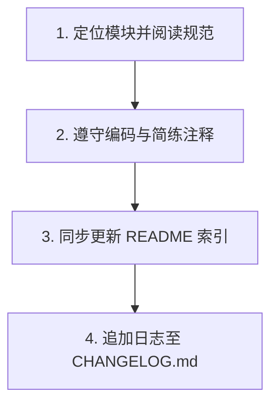

# Agent 规范与模块索引 (AGENTS.md)

本规范定义 Agent 在 PodNote 项目中的核心工作流、测试准则及模块索引。

---

## 1. Agent 核心工作流



1. **定位并阅读规范**：在修改前，根据下方的“模块地图”定位目录，阅读其 `README.md`，理解职责划分。
2. **编码与注释规范**：
   * **代码注释**：注释必须简洁凝练、直击核心，杜绝无意义与繁琐的描述。
   * **技术栈**：保持已有的 Go 后端 + 前端 HTML/JS/CSS + Chrome 插件架构。
3. **更新模块索引**：若新增、重命名或删除文件/模块，必须同步更新对应目录下的 `README.md`。
4. **日志追加**：任务结束时，在项目根目录 [CHANGELOG.md](./CHANGELOG.md) 追加记录。

---

## 2. 测试与浏览器调用规范

* **人工验证优先**：禁止自主使用浏览器执行自动化测试，应引导用户进行手动验证。
* **浏览器调用**：仅在用户明确发出自动化测试指令（如“使用浏览器验证”、“运行自动化测试”）时，才可调用浏览器相关的子代理。

---

## 3. 模块地图

* **Go 后端**：[src/README.md](./src/README.md) — 后端源码（文件加载、PTY 终端、WebSocket 桥接）。
* **飞牛OS打包资源**：[build/README.md](./build/README.md) — 静态资源（`/app/www`）、后端程序（`/app/server`）、生命周期脚本（`/cmd`）、UI 配置（`/app/ui`）及打包配置。
* **Chrome 扩展**：[chrome_extension/README.md](./chrome_extension/README.md) — FNOS 文件管理器集成右键插件源码。
* **开发测试**：[test/README.md](./test/README.md) — 本地 Node.js 仿真服务器与测试物理工作区。

---

## 4. CHANGELOG.md 变更日志规范

* **合并约束**：单次 Git 提交内，同一日期只写一段日志，多次修改合并写入。
* **风格要求**：完全基于事实，内容简洁明确，文件引用使用相对路径（如 `./src/main.go`）。

**格式模板**：
```markdown
## [版本号或日期] - YYYY-MM-DD
- **执行人**: Agent (Antigravity) / User
- **类型**: [新增]/[修改]/[修复]/[重构]
- **受影响模块**: [例如: Go 后端 / 前端 UI / 浏览器插件]
- **变更明细**: 
  - 简述具体改动点 1
  - 简述具体改动点 2
```
