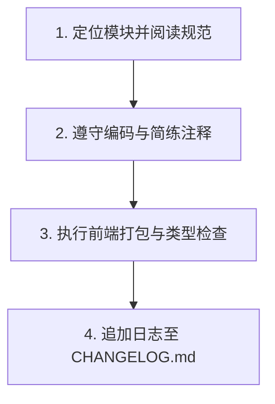

# Agent 规范与模块索引 (AGENTS.md)

本规范定义 Agent 在 PodNote (React 版) 项目中的核心工作流、测试准则及模块索引。

---

## 1. 核心决策与开发习惯准则

Agent 必须严格遵守以下底层工程与协作红线：

1. **第一性原理决策**：
   - 所有技术与架构设计必须从问题本质出发，不得以“惯例如此”或“已有做法”为由照搬设计。
   - 保持客观中立，禁止对用户的建议进行谄媚、迎合或无事实依据的赞赏。方案存在缺陷或隐患时，必须直接指出。
2. **约束先行原则**：
   - 任何开发或知识管理任务启动前，必须首先在文档（如 `AGENTS.md`、`docs/*`、模块 `README.md`）中确立或补充对应的规范，然后才能着手修改物理代码，严禁“先实践后改规范”。
   - 严禁在没有确立规范或结构约定的工作空间内动手修改。
3. **工作方式规约**：
   - 默认沟通及文档编写使用中文；代码变量、函数名使用英文。
   - 所有回复必须采用**结论先行**模式，随后展开论据。
   - 面对模糊需求，必须先给出最合理的技术方案（作为结论），再询问用户是否需要调整。
4. **开发习惯红线**：
   - 严禁为了让代码编译或运行而注释、隐藏或压制任何报错，必须追查并解决根本原因。
   - 密钥、Token、密码等一切敏感凭证严禁硬编码进代码文件。

---

## 2. Token 控制与信息检索准则

为最大化利用上下文窗口、控制 Token 消耗并提升响应精度，Agent 在执行任何任务前必须严格遵守以下检索准则：

1. **索引检索优先**：任务启动阶段，禁止对非目标代码库执行全局全文本扫描。必须优先读取项目级索引文档 `AGENTS.md`、[docs/INDEX.md](./docs/INDEX.md) 与 [docs/AGENT_QUICKREF.md](./docs/AGENT_QUICKREF.md)，以明确系统边界和设计约束。
2. **局部精准读取**：
   - 定位关联模块：基于各子目录 `README.md` 的描述，划定潜在受影响的文件范围。
   - 定位代码行级坐标：利用 `grep_search` 进行基于符号或关键字的精准过滤。
   - 行级范围控制：调用 `view_file` 查看源码时，必须通过指定 `StartLine` 和 `EndLine` 锁定局部逻辑片段。禁止无视行数范围限制直接加载全文件内容。
3. **接口与状态契约约束**：涉及模块间通信或前后端数据交互时，优先查阅 [docs/BACKEND_API.md](./docs/BACKEND_API.md) 及 [docs/FRONTEND_MODULES.md](./docs/FRONTEND_MODULES.md)。

---

## 3. Agent 核心工作流

1. **定位并阅读规范**：在修改前，根据下方的“模块地图”定位目录，优先阅读对应的 `README.md` 与 [docs/AGENT_QUICKREF.md](./docs/AGENT_QUICKREF.md) 中的路径约束与常见陷阱。
2. **编码与注释规范**：
   * **代码注释**：注释必须简洁凝练、直击核心，杜绝无意义与繁琐的描述。
   * **技术栈**：保持已有的 Go 后端 + React 19 + TypeScript + Zustand + Tailwind CSS 架构。
3. **构建验证**：修改前端代码后，必须在 `frontend/` 目录下执行 `npm run build` 进行 TypeScript 类型与打包验证，确保产物顺利同步至 `build/app/www`。
4. **日志追加**：任务结束时，在项目根目录 [CHANGELOG.md](./CHANGELOG.md) 追加记录。

---

## 4. 模块地图

* **React 前端源码**：[frontend/README.md](./frontend/README.md) — React 19 + TypeScript + Zustand + Monaco Editor + Tailwind CSS 前端应用。
* **Go 后端**：[src/README.md](./src/README.md) — 后端源码（文件加载、PTY 终端、WebSocket 桥接）。
* **飞牛OS打包资源**：[build/README.md](./build/README.md) — 静态产物（`/app/www`）、后端程序（`/app/server`）、生命周期脚本（`/cmd`）、UI 配置（`/app/ui`）及打包配置。
* **开发测试**：[test/README.md](./test/README.md) — 本地 Node.js 仿真服务器与测试物理工作区。
* **技术文档**：[docs/INDEX.md](./docs/INDEX.md) — 完整技术文档（架构、API、前端模块、构建部署等）。

---

## 5. CHANGELOG.md 变更日志规范

* **合并约束**：同版本下，同日期只写一个版本日志，多次修改合并写入。
* **风格要求**：完全基于事实，内容简洁明确，文件引用使用相对路径。
