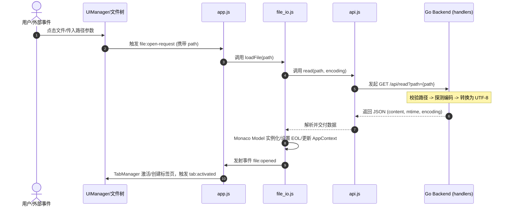
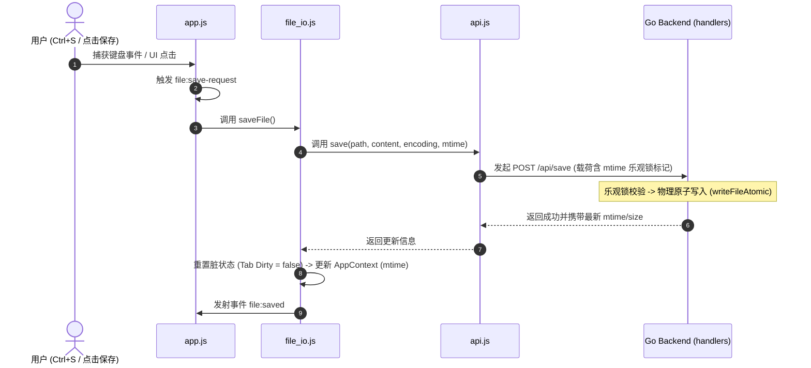
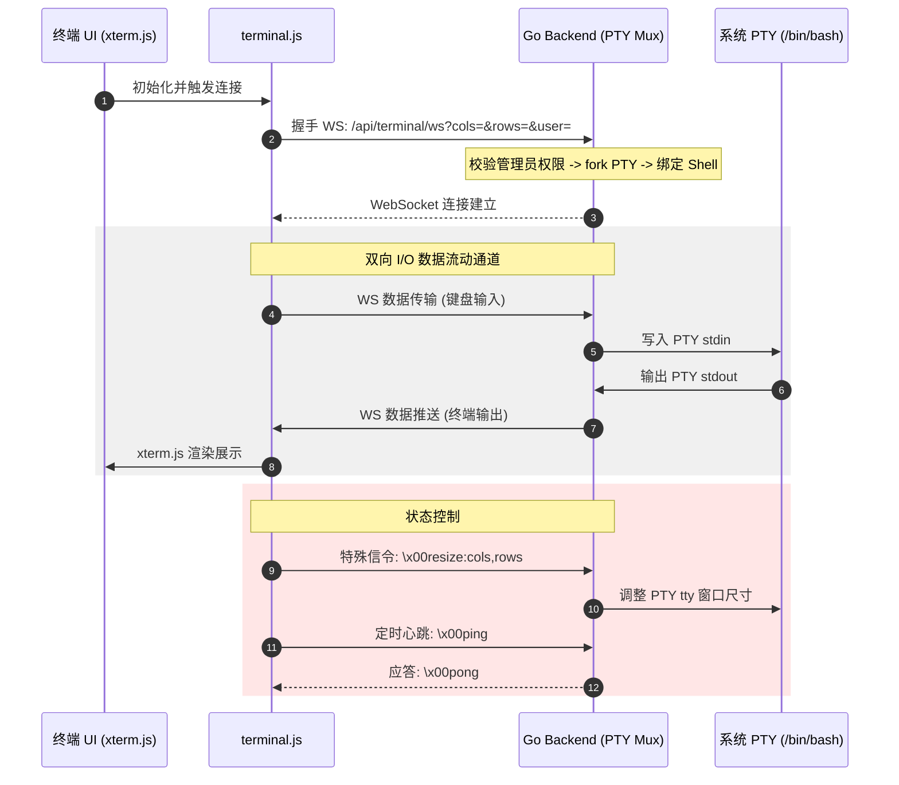

# 系统架构详解 (ARCHITECTURE.md)

---

## 1. 技术栈规范

| 层级 | 核心技术 | 职责与协议 |
|:---|:---|:---|
| 后端 | Go 1.21+ | Unix Socket 监听、HTTP 协议、WebSocket (无三方 Web 框架) |
| 前端 | 原生 HTML5 / ES Module | Monaco Editor Core (AMD)、xterm.js、marked |
| 扩展 | Chrome MV3 | Background Service Worker, MAIN world 脚本动态注入 |
| 打包 | FNOS fnpack | 编译打包为 `.fpk` 分发包 |

---

## 2. 运行拓扑

```
飞牛OS 宿主 (Debian)
┌────────────────────────────────────────────────────────┐
│  飞牛OS 网关 (Nginx/Traefik)                            │
│  ├── /app/m-text-editor/*  →  Unix Socket 转发          │
│  └── 其他应用路由                                        │
│                                                        │
│       转发通道: unix://m-text-editor.sock              │
└──────────────────────────┬─────────────────────────────┘
                           │
┌──────────────────────────▼─────────────────────────────┐
│  PodNote Go 后端 (容器内)                                │
│  ├── 动态入口网关 (处理 index.html/?v= 静态缓存失效)     │
│  ├── HTTP API (/api/read, /api/save, /api/list)        │
│  ├── WebSocket PTY (/api/terminal/ws)                  │
│  └── WebSocket 轮询监控 (/api/watch/ws)                 │
└──────────────────────────┬─────────────────────────────┘
                           │
┌──────────────────────────▼─────────────────────────────┐
│  前端 (浏览器 SPA)                                       │
│  ├── app.js (主入口协调器)                               │
│  ├── js/ (业务子模块: api, editor, tabs 等)              │
│  └── plugins/ (触屏、键盘锁、环境注入)                    │
└────────────────────────────────────────────────────────┘
```

---

## 3. 请求过滤与中间件链

进入 Unix Socket 的 HTTP 请求处理管道必须依次通过以下 Filter 链组装：

```
HTTP Request ──► loggingMux ──► cacheMiddleware ──► gzipMiddleware ──► adminAuthMiddleware ──► Route Handler
```

| 过滤器 | 物理定义位置 | 核心控制逻辑 |
|:---|:---|:---|
| `loggingMux` | `src/main.go` | 审计所有 HTTP 方法与目标 URI。 |
| `cacheMiddleware` | `src/middleware.go` | Monaco 组件 (`/vs/`) 强缓存 1 年。对带有 `?v=` 的资源配置 30 天缓存。 |
| `gzipMiddleware` | `src/middleware.go` | 针对 `.js`, `.css`, `.html` 开启透明压缩，过滤 WebSocket 连接。 |
| `adminAuthMiddleware` | `src/middleware.go` | 校验网关请求头 `X-Trim-Isadmin: true`，拒绝非管理员访问。 |

---

## 4. 静态资源版本缓存失效设计 (版本注入网关)

静态资源通过 `src/main.go` 进行网关级版本参数过滤注入：
* **入口拦截**：请求 `index.html` 时，Go 服务动态读取 `build/manifest` 的 `version` 并为 `style.css` 和 `app.js` 的 `src/href` 路径拼接 `?v={appVer}` 后缀。
* **依赖依赖注入**：对业务 `.js` 请求，动态拦截并为其中所有的 `import ... from '...js'` 语句追加 `?v={appVer}` 标记，使得浏览器内的缓存链全面强制刷新。

---

## 5. 前端生命周期与初始化时序

```
[Index.html 载入]
       │
       ├─► 1. 解析参数 (?path=, ?encoding=) 并发起 Fetch 预加载请求
       ├─► 2. 检测注入环境 (Parent Window / FNOS Extension)
       ├─► 3. 异步载入 Monaco AMD Loader (vs/loader.js)
       └─► 4. 模块初始化载入 (app.js)
                 │
                 ├─► 5. 初始化 AppContext (全局状态机)
                 ├─► 6. 绑定 EventBus 事件监听
                 ├─► 7. 配置 Monaco 环境并加载 Monaco Core
                 ├─► 8. 拉取 Settings 配置并应用
                 └─► 9. 按序挂载 UIManager, TabManager, TerminalManager
```

---

## 6. 核心数据流控制时序 (Sequence Diagrams)

### 6.1 文件加载流程



### 6.2 文件保存流程



### 6.3 终端交互与 PTY 生命周期



---

## 7. 容器环境变量说明

容器运行依赖以下由飞牛OS应用平台注入的环境变量：

| 变量键名 | 物理意义 | 典型示例 |
|:---|:---|:---|
| `TRIM_APPDEST` | 应用主安装目录（只读，挂载 HTML/JS/CSS 及二进制文件） | `/app/m-text-editor` |
| `TRIM_APPVER` | 当前运行的应用版本号 | `1.3.0` |
| `TRIM_PKGVAR` | 可写持久化存储目录（存放云端 settings.json 及运行日志） | `/vol1/1000/appdata/m.text.editor` |
| `X-Trim-Isadmin` | 网关透传鉴权头，用于识别管理员特权 | `"true"` |
| `X-Trim-Username` | 网关透传的当前操作用户名 | `"admin"` |
