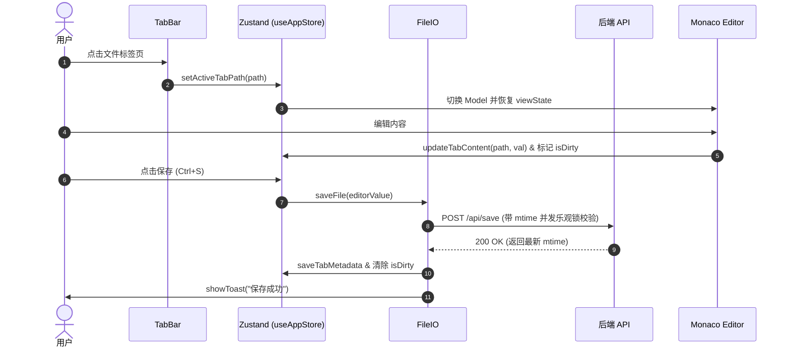

# 系统架构详解 (ARCHITECTURE.md)

---

## 1. 技术栈规范

| 层级 | 核心技术 | 职责与协议 |
|:---|:---|:---|
| 后端 | Go 1.21+ | Unix Socket 监听、HTTP 协议、WebSocket (无三方 Web 框架) |
| 前端 | React 19 + TypeScript + Zustand | Monaco Editor Core、xterm.js、Tailwind CSS、Vite 构建工具链 |
| 扩展 | Chrome MV3 | Background Service Worker, MAIN world 脚本动态注入 |
| 打包 | FNOS fnpack | 编译打包为 `.fpk` 分发包 |

---

## 2. 运行拓扑

```
飞牛OS 宿主 (Debian)
┌────────────────────────────────────────────────────────┐
│  飞牛OS 网关 (Nginx/Traefik)                            │
│  ├── /app/podnote/*  →  Unix Socket 转发                │
│  └── 其他应用路由                                        │
│                                                        │
│       转发通道: unix://podnote.sock                    │
└──────────────────────────┬─────────────────────────────┘
                           │
┌──────────────────────────▼─────────────────────────────┐
│  PodNote Go 后端 (容器内)                                │
│  ├── 静态资源服务 (/app/www)                           │
│  ├── HTTP API (/api/read, /api/save, /api/list)        │
│  ├── WebSocket PTY (/api/terminal/ws)                  │
│  └── WebSocket 实时监控 (/api/watch/ws)                │
└──────────────────────────┬─────────────────────────────┘
                           │
┌──────────────────────────▼─────────────────────────────┐
│  React 前端 (浏览器 SPA)                                │
│  ├── App.tsx (主应用容器与 VisualViewport 适配)         │
│  ├── Zustand Store (全局响应式单向数据流)               │
│  ├── Monaco Editor (编辑器内核与移动端辅助插件)         │
│  └── UI 组件树 (顶栏, TabBar, 侧栏, 终端, 状态栏, 弹窗) │
└────────────────────────────────────────────────────────┘
```

---

## 3. 请求过滤与中间件链

进入 Unix Socket 的 HTTP 请求处理管道必须依次通过以下 Filter 链组装：

```
HTTP Request ──► loggingMux ──► cacheMiddleware ──► gzipMiddleware ──► adminAuthMiddleware ──► Route Handler
```

| 过滤器 | 物理定义位置 | 核心控制逻辑 |
|:---|:---|:---|
| `loggingMux` | `src/main.go` | 审计所有 HTTP 方法与目标 URI。 |
| `cacheMiddleware` | `src/middleware.go` | 静态资源强缓存，对带有 hash 的产物高效缓存。 |
| `gzipMiddleware` | `src/middleware.go` | 针对 `.js`, `.css`, `.html` 开启透明压缩，过滤 WebSocket 连接。 |
| `adminAuthMiddleware` | `src/middleware.go` | 校验网关请求头 `X-Trim-Isadmin: true`，拒绝非管理员访问。 |

---

## 4. 前端组件与状态流控制时序


